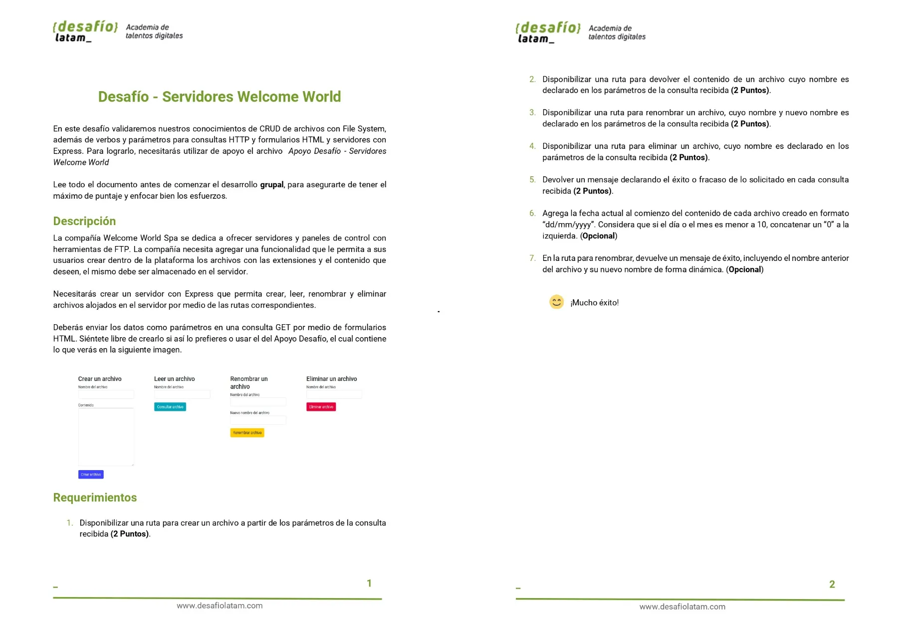
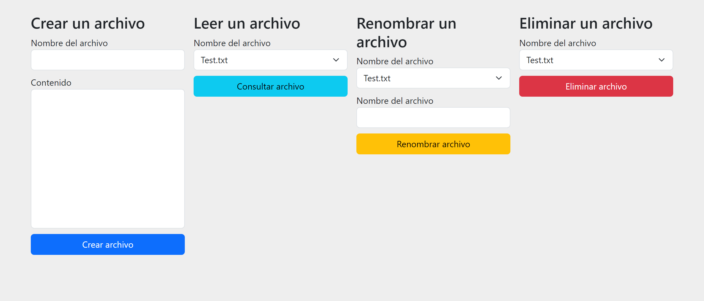
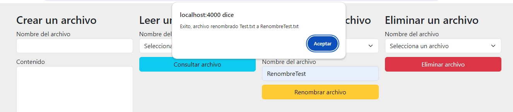
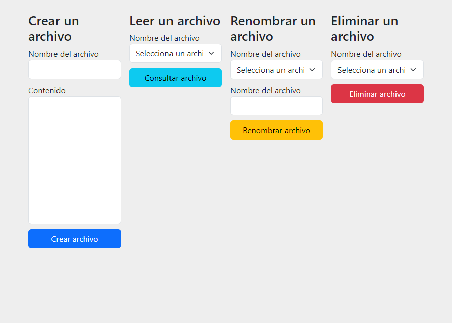
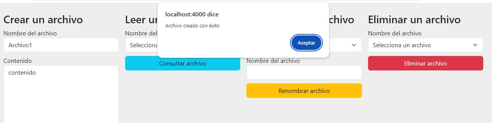
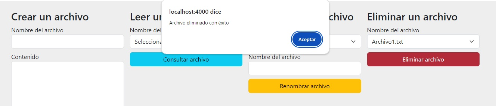

# Solución Desafío 3 Servidores Welcome World

El presente repositorio contiene el código solución del desafío número **3** del módulo 6 Desarrollo de aplicaciones web con Node y Express.

Las tecnologías utilizadas fueron las siguientes:


Junto con la librería **express-handlebars** para servir vistas desde el servidor.

Los requisitos del proyecto son los siguientes:



El proyecto presenta las siguientes funcionalidades:

| Funcionalidades                                                           |
| ------------------------------------------------------------------------- |
| Crear archivo .txt                                                        |
| Leer contenido de archivos .txt                                           |
| Renombrar archivos                                                        |
| Eliminar archivos                                                         |
| No permitir crear archivos con nombre identico                            |
| Mostrar nombre de archivos y extensión en select                          |
| Mostrar alertas de acción exitosa al crear, renombrar y eliminar archivos |

A continuación explico cada una de mis soluciones a cada requerimiento incluso los requerimientos opcionales:

## 1. Disponibilizar una ruta para crear un archivo a partir de los parámetros de la consulta recibida (2 Puntos)

He creado la ruta **crear** la cual escribe archivos de extensión de tipo **.txt** en la carpeta **archivos** en el servidor. Además, almaceno en un array objetos con el nombre del archivo y el contenido.

De lado del servidor, el código es el siguiente:

```js
router.get("/crear", (req, res) => {
  const { archivo, contenido } = req.query;
  res.locals.archivos.push({ archivo, contenido });
  fs.writeFile(`archivos/${archivo}.txt`, contenido, "utf8", (err) => {
    if (err) {
      console.error(err);
      res.status(500).send("Error al crear el archivo");
    } else {
      console.log("Archivo creado correctamente");
      res.locals.archivos.push({ archivo, contenido });
      res.status(200).send("Archivo creado correctamente");
    }
  });
});
```

De lado del cliente, el código es el siguiente:

```js
formularioCrear.on("submit", function (e) {
  e.preventDefault();
  fetch(window.location.origin + "/datos")
    .then(function (response) {
      if (response.ok) {
        return response.json();
      } else {
        throw new Error("Error al leer desde el servidor"); // throw Error("Error al leer desde el servidor");
      }
    })
    .then((response) => {
      const formData = new FormData(this);

      if (!response.includes(formData.get("archivo") + ".txt")) {
        crearArchivo(this, formData);
      } else {
        alert("El archivo ya existe");
      }
    });
});
```

En el cual utilizo la función **crearArchivo** siguiente:

```js
function crearArchivo(formulario, formData) {
  const params = new URLSearchParams();

  for (const [key, value] of formData.entries()) {
    params.append(key, value);
  }

  const url = formulario.action + "?" + params.toString();
  fetch(url, {
    method: "GET",
  })
    .then((response) => {
      if (response.ok) {
        window.location.href = window.location.origin;
        alert("Archivo creado con éxito");
      } else {
        console.error("La petición CREAR falló");
      }
    })
    .catch((error) => {
      console.error("Hubo un error en la petición CREAR:", error);
    });
}
```

El array de objetos lo creo por medio del middleware siguiente:

```js
router.use((req, res, next) => {
  const directorio = "archivos";
  fs.readdir(directorio, (err, archivos) => {
    if (err) {
      console.error("Error al leer el directorio:", err);
      res.status(500).send("Error interno del servidor");
    }

    res.locals.archivos = archivos;
    next();
  });
});
```

A continuación muestro la creación con éxito de un archivo llamado **Test**:



## 2. Disponibilizar una ruta para devolver el contenido de un archivo cuyo nombre es declarado en los parámetros de la consulta recibida (2 Puntos)

El código con el cual creo dicha ruta llamada **/leer** es el siguiente:

```js
router.get("/leer", (req, res) => {
  const { archivo } = req.query;

  fs.readFile(`archivos/${archivo}`, "utf8", (err, data) => {
    if (err) {
      console.error(err);
      res.status(500).send("Error al leer el archivo");
    } else {
      res.render("contenido", {
        archivo,
        data: `${obtenerFechaFormateada()}-${data}`,
      });
    }
  });
});
```

Leo el archivo respectivo y renderizo una vista con la data contenido del archivo. La vista tiene el siguiente código:

```hbs
<section>
  <button class="btn btn-primary contenido_button">
    <a href="/">Volver a Inicio</a>
  </button>
  <h1 class="contenido_title">Contenido de Archivo {{archivo}}</h1>
  <p class="contenido_parrafo">{{data}}</p>
</section>
```

Un screenshot mostrando el contenido del archivo creado en el punto 1 es el siguiente:


## 3. Disponibilizar una ruta para renombrar un archivo, cuyo nombre y nuevo nombre es declarado en los parámetros de la consulta recibida (2 Puntos)

El código en el lado del servidor es el siguiente:

```js
router.get("/renombrar", (req, res) => {
  const { nombre_seleccionado, nombre_nuevo } = req.query;

  fs.rename(
    `archivos/${nombre_seleccionado}`,
    `archivos/${nombre_nuevo}.txt`,
    (err, data) => {
      if (err) {
        console.error(err);
        res.status(500).send("Error al renombrar el archivo");
      } else {
        res.status(200).json({
          mensaje: "Exito, archivo renombrado",
          nombre_seleccionado,
          nombre_nuevo,
        });
      }
    }
  );
});
```

El código en el lado del cliente es el siguiente:

```js
formularioRenombrar.on("submit", function (e) {
  e.preventDefault();
  const formData = new FormData(this);
  const params = new URLSearchParams();

  for (const [key, value] of formData.entries()) {
    params.append(key, value);
  }

  const nombreAntiguo = formData.get("nombre_seleccionado");
  const nombreNuevo = formData.get("nombre_nuevo");
  const url = this.action + "?" + params.toString();
  fetch(url, {
    method: "GET",
  })
    .then((response) => {
      if (response.ok) {
        return response.json();
      } else {
        console.error("La petición CREAR falló");
        throw new Error("La petición CREAR falló");
      }
    })
    .catch((error) => {
      console.error("Hubo un error en la petición CREAR:", error);
    })
    .then((response) => {
      window.location.href = window.location.origin;
      alert(
        `${response.mensaje} ${response.nombre_seleccionado} a ${response.nombre_nuevo}.txt`
      );
    });
});
```

Cuando hago click en el botón **RenombrarArchivo** se renombra el archivo en el servidor y en el cliente se muestra una alerta de renombre exitoso:




## 4. Disponibilizar una ruta para eliminar un archivo, cuyo nombre es declarado en los parámetros de la consulta recibida (2 Puntos)

He creado la ruta **/eliminar** siguiente:

```js
router.get("/eliminar", (req, res) => {
  const { nombre_archivo } = req.query;

  fs.unlink(`archivos/${nombre_archivo}`, (err) => {
    if (err) {
      console.error("Error al eliminar el archivo:", err);
      res.status(500).send("Error al renombrar el archivo");
    } else {
      res.status(200).send("Archivo eliminado correctamente");
    }
  });
});
```

De lado del cliente dejo el comportamiento he creado el siguiente código para su manejo:

```js
formularioEliminar.on("submit", function (e) {
  e.preventDefault();
  const formData = new FormData(this);
  const params = new URLSearchParams();

  for (const [key, value] of formData.entries()) {
    params.append(key, value);
  }

  const url = this.action + "?" + params.toString();
  fetch(url, {
    method: "GET",
  })
    .then((response) => {
      if (response.ok) {
        window.location.href = window.location.origin;
        alert("Archivo eliminado con éxito");
      } else {
        console.error("La petición CREAR falló");
      }
    })
    .catch((error) => {
      console.error("Hubo un error en la petición CREAR:", error);
    });
});
```

Cuando se elimina un archivo se muestra un alerta con un mensaje de éxito.

A continuación muestro que los select no poseen ningún archivo ya que se elimino el archivo de prueba:



## 5. Devolver un mensaje declarando el éxito o fracaso de lo solicitado en cada consulta recibida (2 Puntos)

Muestro alertas cuando se **crea** un archivo, cuando se **renombra** un archivo y cuando se **elimina** un archivo. Dichas alertas las muestro después de redirigir a la ruta raíz.





## 6. Agrega la fecha actual al comienzo del contenido de cada archivo creado en formato “dd/mm/yyyy”. Considera que si el día o el mes es menor a 10, concatenar un “0” a la izquierda. (Opcional)

He agregado la fecha utilizando la siguiente función:

```js
function obtenerFechaFormateada() {
  const fecha = new Date();

  const dia = String(fecha.getDate()).padStart(2, "0");
  const mes = String(fecha.getMonth() + 1).padStart(2, "0");
  const year = fecha.getFullYear();

  const fechaFormateada = `${dia}/${mes}/${year}`;

  return fechaFormateada;
}
```

## 7. En la ruta para renombrar, devuelve un mensaje de éxito, incluyendo el nombre anterior del archivo y su nuevo nombre de forma dinámica. (Opcional)

En el lado del servidor envío un mensaje de éxito, el nombre antiguo y el nombre nuevo:

```js
router.get("/renombrar", (req, res) => {
  const { nombre_seleccionado, nombre_nuevo } = req.query;

  fs.rename(
    `archivos/${nombre_seleccionado}`,
    `archivos/${nombre_nuevo}.txt`,
    (err, data) => {
      if (err) {
        console.error(err);
        res.status(500).send("Error al renombrar el archivo");
      } else {
        res.status(200).json({
          mensaje: "Exito, archivo renombrado",
          nombre_seleccionado,
          nombre_nuevo,
        });
      }
    }
  );
});
```

En el lado del cliente muestro dicho mensaje en un alerta:

```js
formularioRenombrar.on("submit", function (e) {
  e.preventDefault();
  const formData = new FormData(this);
  const params = new URLSearchParams();

  for (const [key, value] of formData.entries()) {
    params.append(key, value);
  }

  const nombreAntiguo = formData.get("nombre_seleccionado");
  const nombreNuevo = formData.get("nombre_nuevo");
  const url = this.action + "?" + params.toString();
  fetch(url, {
    method: "GET",
  })
    .then((response) => {
      if (response.ok) {
        return response.json();
      } else {
        console.error("La petición CREAR falló");
        throw new Error("La petición CREAR falló");
      }
    })
    .catch((error) => {
      console.error("Hubo un error en la petición CREAR:", error);
    })
    .then((response) => {
      window.location.href = window.location.origin;
      alert(
        `${response.mensaje} ${response.nombre_seleccionado} a ${response.nombre_nuevo}.txt`
      );
    });
});
```
